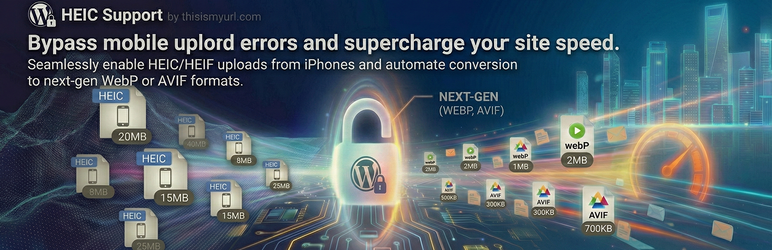

# HEIC Support by thisismyurl.com

🔗 **[Register](https://thisismyurl.com/heic-support-thisismyurl/#register)**

**HEIC Support by thisismyurl.com** is the essential performance bridge for modern WordPress sites. 

If you or your contributors upload photos directly from an iPhone or a modern Android device, you have likely encountered "File type not supported" errors or images that won't display. This plugin removes those barriers by adding native support for HEIC (High Efficiency Image Coding) and HEIF containers.

### Mobile-First Performance
Don't let mobile formats slow down your site. While HEIC is great for storage, it isn't always web-friendly. Our plugin allows you to automatically "develop" these mobile photos into **WebP** or **AVIF** upon upload, reducing file sizes significantly while maintaining stunning visual clarity.

### Key Benefits & Features:
* **Enable HEIC Uploads:** Safely allow `.heic` and `.heif` files to be uploaded directly to your Media Library.
* **Next-Gen Conversion:** Automatically transform mobile photos into ultra-fast WebP or AVIF formats.
* **Boost Site Speed:** Improve your Core Web Vitals and SEO by serving optimized, modern images to your visitors.
* **Ecosystem Aware:** Automatically detects if you have our **WebP Support** or **AVIF Support** plugins active to unlock advanced conversion paths.
* **Precision Quality Control:** Fine-tune your compression with easy-to-use quality sliders in the Tools menu.

## ⚙️ Installation
1. Upload the `heic-support-thisismyurl` folder to the `/wp-content/plugins/` directory.
2. Activate the plugin through the 'Plugins' menu in WordPress.
3. Navigate to **Tools > HEIC Support** to select your preferred conversion format.

## ❓ FAQ
### Is this plugin free?
Yes! The core functionality of HEIC Support is 100% free to download and use. We want to make it easy for everyone to use modern mobile photos on the web.
### Why should I register for support?
While the plugin is free, registering your copy allows you to access priority technical support and receive automatic updates directly in your dashboard. Registration helps us continue to keep the plugin compatible with the latest mobile devices and WordPress versions.
### How do I register?
Visit [https://thisismyurl.com/heic-support-thisismyurl/#register](https://thisismyurl.com/heic-support-thisismyurl/#register) to sign up for a support license. Once you have your key, enter it into the "License Key" field in the plugin settings.
### Does my server support HEIC?
This plugin uses your server's ImageMagick (Imagick) library. Most modern hosts support HEIC by default, but you can verify your server status inside the plugin dashboard.

## 🗺️ Roadmap & Activity

---
([char]0x00A9) 2026 [thisismyurl](https://thisismyurl.com)